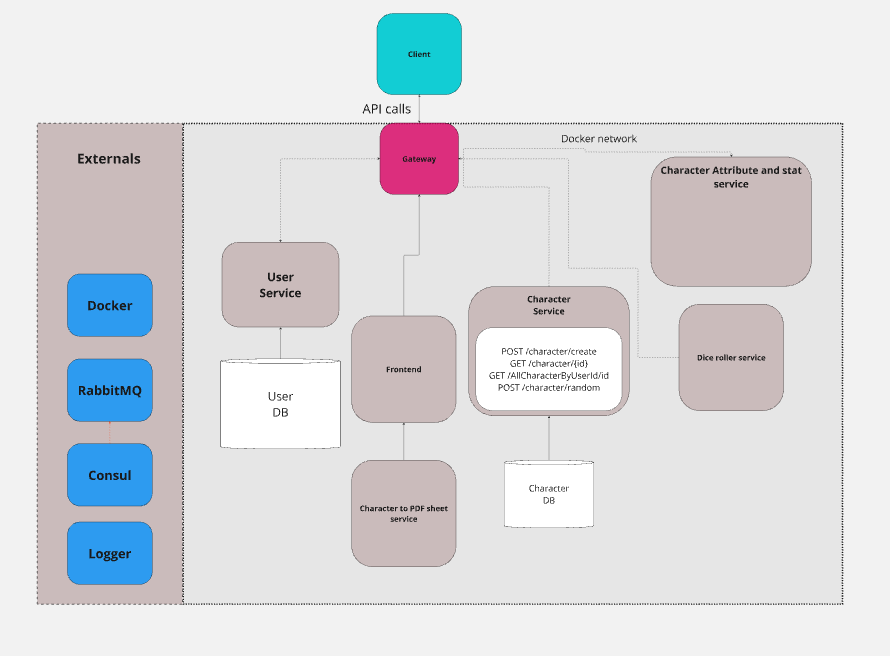
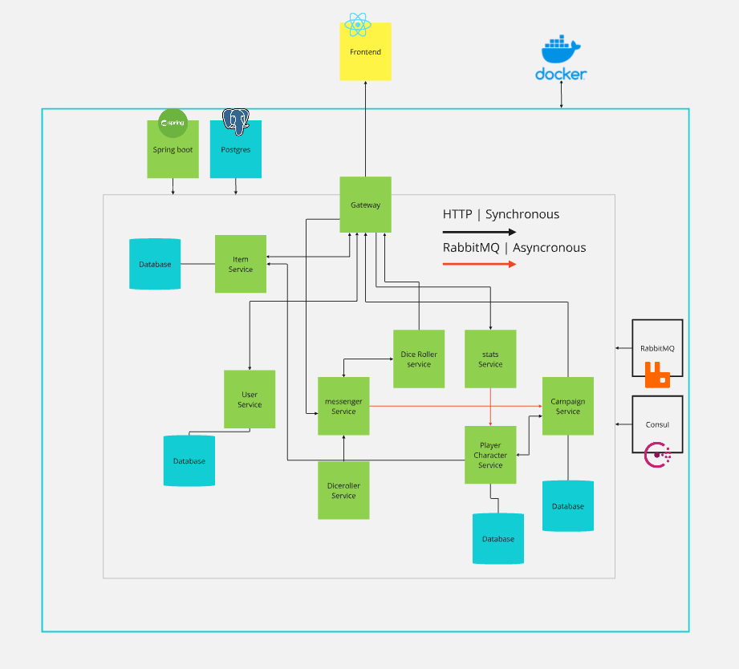

# PG3402-Mikrotjenester-dragepust


Running Dragepust character sheet and campaign sheet


Build and run
```
docker compose -f .\docker-compose.yml up --build
```

Launching without building
```
docker compose -f .\docker-compose.yml up
```

Removes ALL docker images and volumes
```
docker system prune -a --volumes
```

User Stories from Arbeidskrav:

* As a user I can create a new character using the character generator, so that I can
quickly and easily be ready to play
* As a user I can choose a character from the character selection, so that I can change
between my favourite characters
* As a user I can interact with their existing character, adding items, health etc., so that I
can keep updating the character





