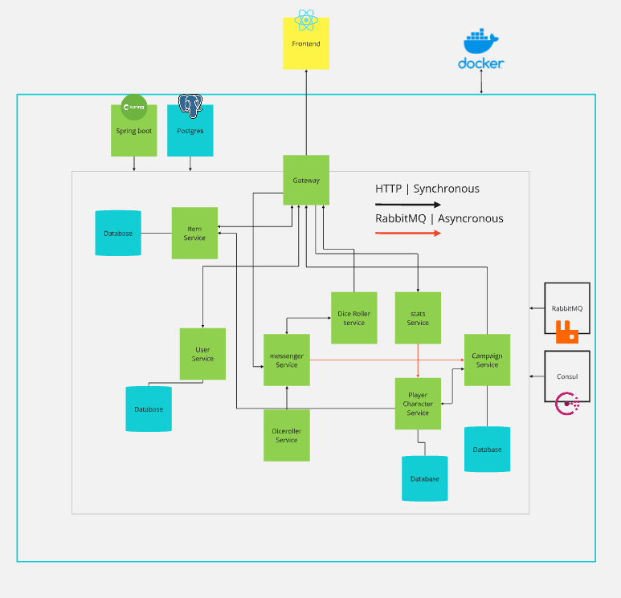

# PG3402-Mikrotjenester-dragepust

## Project Overview

This project is modelled after a role-playing game called Dragepust. The application will primarily help and simplify the character creation process by keeping track of things such as rules, choices and calculations, so that the players can create a new character on the go. With an existing character, the user will be able to interact with them by doing things like: adding or losing health, track spells and magic, and roll dice.

Functionality:

* Create a user, or log in
* Create a new character
* Select an existing character
* Interact with an existing character
* Create a campaign
* Join an existing campaign
* Interact with an existing campaign
* Roll dice for characters and campaigns


## How to run
For Frontend
```
cd Frontend/microClient
npm install
npm run dev
```
Build and run in Backend
```
cd docker
docker compose -f .\docker-compose.yml up --build
```

Launching without building
```
docker compose -f .\docker-compose.yml up
```

Removes ALL docker images and volumes
```
docker system prune -a --volumes
```

### User Stories from Arbeidskrav:

* As a user I can create a new character using the character generator, so that I can
  quickly and easily be ready to play (Done)


* As a user I can choose a character from the character selection, so that I can change
  between my favourite characters (Done)


* As a user I can interact with their existing character, adding items, health etc., so that I
  can keep updating the character (Done)

### User Stories from Eksamen
In addition, we added the following user stories based on feedback from the arbeidskrav:


* As a user I can create a campaign using the campaign generator, so that I can play with
  keep track of my players(Done)


* As a user I can join an existing campaign, so that I can play with my party(Done)

Architecture diagram from arbeidskrav

Final architecture diagram



### Example use case


### On Teamwork
As a group of two, we planned and discussed the project specifications together. Because of this we were able to take advantage of the modularity microservices provide, letting us work on different parts of the project at the same time.

Both worked on:
* Character Service
* Frontend

Candidate 10 worked on:
* Setting up Frontend configuration(Routes, HTTP requests, etc.)
* User service
* Stats service


Candidate 11 worked on:
* Campaign Service
* Item service
* Messenger Service
* Dice roller service
* Setting up Backend configuration (Docker, Consul, RabbitMQ, etc.) 
